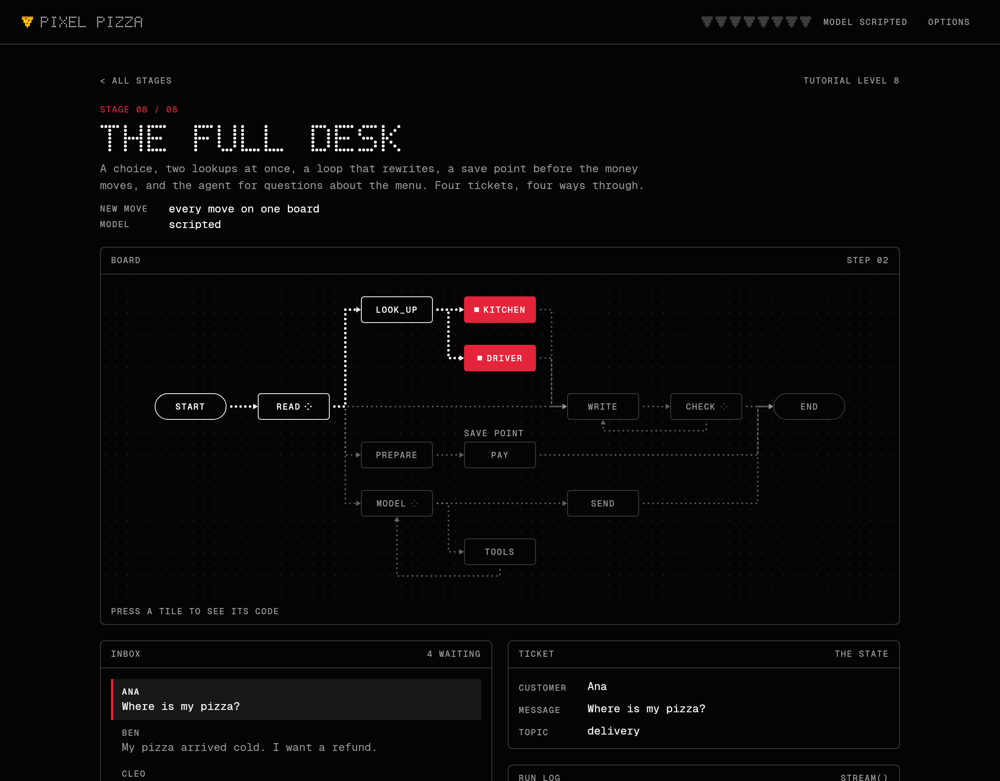
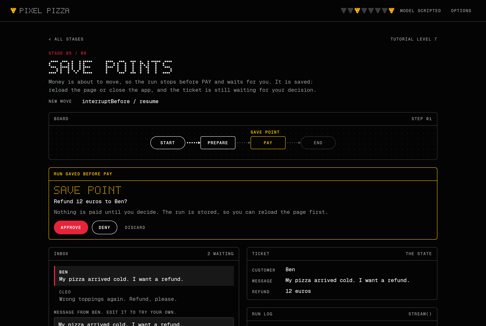
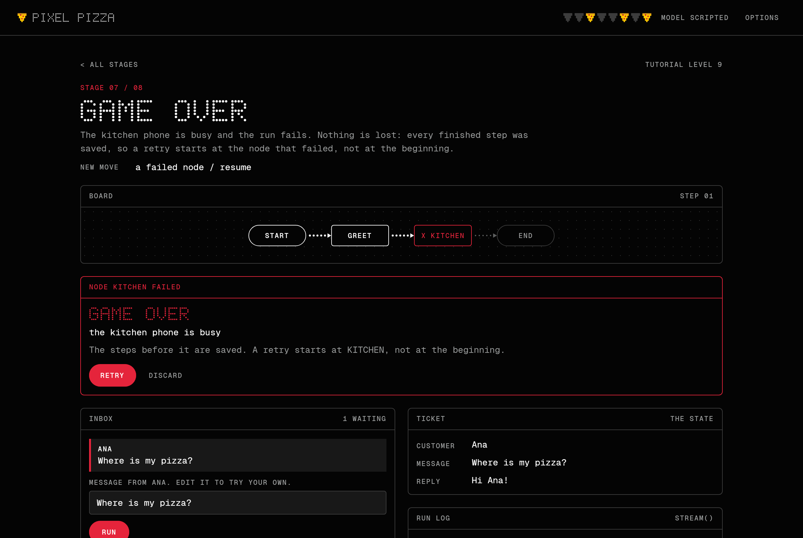

# Pixel Pizza

A small game about graphs. You run the help desk of a pizza shop: customers write in, a
[Telar](https://github.com/deeptelar/telar) graph writes back, and you watch
the ticket cross the board node by node.

**[Play it in your browser](https://deeptelar.github.io/telar-demo/)**



It is the [Telar tutorial](https://github.com/deeptelar/telar/tree/main/docs/tutorial)
made playable. Eight stages, one new move each, the same Pixel Pizza help desk growing from two
nodes to a full agent workflow. One Compose Multiplatform codebase runs it in the browser
(Kotlin/Wasm), on the desktop (JVM) and on Android. No account and no API key needed.

## Stages

| # | Stage | The move |
|---|---|---|
| 1 | A line | Two nodes in a row: `node`, `then`, `invoke` |
| 2 | Choices | `conditionalEdge` picks one of three paths |
| 3 | Loops | An edge that goes back until the reply passes a check |
| 4 | Two at once | Fan-out to nodes with a `work` and an `update`, which run at the same time |
| 5 | Save points | `interruptBefore` stops the run for you; `resume` continues it, also after a reload |
| 6 | The agent | A model that calls tools, as a loop of two nodes |
| 7 | Game over | A node fails; `resume` retries from the last save |
| 8 | The full desk | All of it on one board: four kinds of ticket, four ways through |

Each stage is the level of the tutorial with the same number: stage 3 is level 3.

Watching a run with `stream()`, the second half of level 4, is not only in stage 4. It is the game:
the board, the ticket panel and the run log are drawn from the events of `stream()` as they arrive.
In the stages that ask a model, the run log shows the answer word by word while the model writes it.

Press a tile on the board to see the code behind it: the node, its arrows and the functions it calls.
The text is cut out of the game's own source files when the app is built, so it is always the code
that runs.

| | |
|---|---|
|  |  |

## Play

The browser version is at <https://deeptelar.github.io/telar-demo/>. Every push to
`main` publishes it there.

To run it from a clone of this repository:

```bash
./gradlew :composeApp:wasmJsBrowserDevelopmentRun   # browser, with a dev server
./gradlew :composeApp:run                           # desktop
./gradlew :androidApp:installDebug                  # Android, on a connected device or emulator
```

Requires JDK 17 or newer. The Android app also needs the Android SDK with platform 37: set
`ANDROID_HOME`, or put `sdk.dir=/path/to/Android/Sdk` in a `local.properties` file in this
directory. It runs on Android 7 and newer.

Stages 6 and 8 ask a model. By default that is a scripted one with fixed answers. To play them
with Claude, enter your own Anthropic API key under Options and pick a model; they are listed from
the cheapest to the most expensive, with their prices. The key goes straight from the app
to `api.anthropic.com` and is kept in memory unless you tick "Remember the key on this device".
Requests are billed to your account.

## How it works

- **A stage is a graph and a map.** [`game/HelpDesks.kt`](composeApp/src/commonMain/kotlin/dev/deeptelar/telar/demo/game/HelpDesks.kt)
  and [`game/Agent.kt`](composeApp/src/commonMain/kotlin/dev/deeptelar/telar/demo/game/Agent.kt) hold
  the eight graphs. [`game/Stages.kt`](composeApp/src/commonMain/kotlin/dev/deeptelar/telar/demo/game/Stages.kt)
  gives each one its briefing, its inbox, and the cell of every node on the board.
- **The board draws the graph it is given.** Tiles sit where the stage puts them. The arrows are
  read from `CompiledGraph.topology`, and they light up from the `NodeStarted`, `NodeCompleted` and
  `StepCompleted` events of the run.
- **A save point is a checkpoint.** Runs are saved by the library's checkpointers:
  `LocalStorageCheckpointer` in the browser, `FileCheckpointer` on the desktop and on Android. That
  is why a ticket waiting for your decision survives a reload, and why a failed run can be retried
  from the node that failed.
- **The look is drawn, not themed.** Black, white, a ramp of greys and one red, after
  [nothing.tech](https://nothing.tech). The headings are a 5 by 7 dot-matrix alphabet in
  [`ui/DotMatrix.kt`](composeApp/src/commonMain/kotlin/dev/deeptelar/telar/demo/ui/DotMatrix.kt), the
  pizza is text in [`ui/Sprites.kt`](composeApp/src/commonMain/kotlin/dev/deeptelar/telar/demo/ui/Sprites.kt),
  and the rest is Geist Mono. There is no Material in the app.

## Layout

- `game/`: the ticket (the state), the graphs of the stages, the tools of the agent
- `llm/`: the scripted model, and the Claude models on offer. The chat model interface, the Claude
  client and the agent loop come from `telar-agent` and `telar-anthropic`
- `storage/`: which checkpointer of the library each platform uses, and `KeyValueStore` for the
  settings and the cleared stages
- `ui/`: the screens, the board, and `Game.kt`, which runs the graphs for them

## Tests

```bash
./gradlew :composeApp:jvmTest             # everything, on the JVM
./gradlew :composeApp:wasmJsBrowserTest   # the common tests again in headless Chrome (needs Chrome)
```

The JVM run also clicks through the game the way a player would, and draws every screen to
`composeApp/build/screenshots`. The pictures in this README come from there. So does
`social-preview.png`, the picture a link to the game or to this repository is shown with: copy it
to `composeApp/src/wasmJsMain/resources/` after a change, and upload the same file under Settings,
Social preview.

Building this app is a test of Telar from outside its repository. What that turned up is in
[FINDINGS.md](FINDINGS.md).

## License

[Apache License 2.0](LICENSE). Geist Mono is bundled under the
[SIL Open Font License](licenses/GeistMono-OFL.txt).
