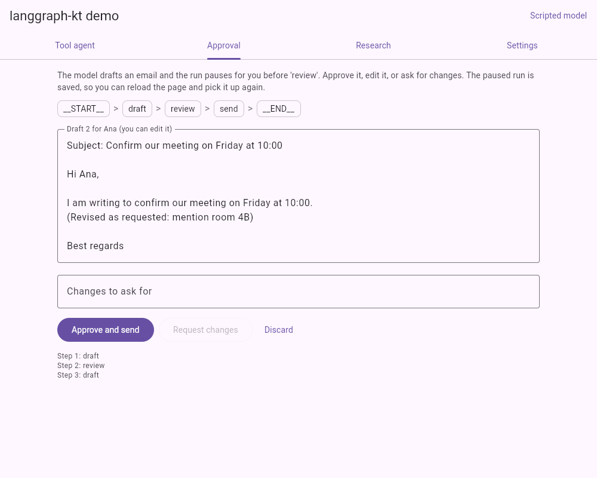

# langgraph-kt demo

A Compose Multiplatform app that runs agent workflows built with
[langgraph-kt](https://github.com/Cuento3yLlevo2/langgraph-kt) in the browser (Kotlin/Wasm) and on
the desktop (JVM). It exists to try the library in a real application before its first release;
what that turned up is in [FINDINGS.md](FINDINGS.md).



## Workflows

| Screen | Graph | Library features |
|---|---|---|
| Tool agent | `assistant` and `tools` in a loop until the model answers in text | Cycles, conditional edges, `stream()` |
| Approval | `draft`, then a pause before `review`, then `send` or back to `draft` | `interruptBefore`, `resume` with a state update, a custom `Checkpointer`, resuming after a page reload |
| Research | Three angles in parallel, then `summarize` | Fan-out, `Reducer`, fan-in |

Each workflow is one file in
[`composeApp/src/commonMain/kotlin/org/langgraphkt/demo/workflows`](composeApp/src/commonMain/kotlin/org/langgraphkt/demo/workflows).

## Models

- **Scripted model** (default): fixed answers, works offline, needs no key.
- **Claude**: enter your own Anthropic API key under Settings. The key goes straight from the app to
  `api.anthropic.com` and is kept in memory unless you tick "Remember the key on this device".
  Requests are billed to your account.

## Running it

langgraph-kt is not on Maven Central yet, so publish it to your local Maven repository first:

```bash
git clone https://github.com/Cuento3yLlevo2/langgraph-kt.git
cd langgraph-kt && ./gradlew publishToMavenLocal
```

Then, in this repository:

```bash
./gradlew :composeApp:wasmJsBrowserDevelopmentRun   # browser, opens http://localhost:8080
./gradlew :composeApp:run                           # desktop
./gradlew :composeApp:jvmTest                       # tests on the JVM
./gradlew :composeApp:wasmJsBrowserTest             # the same tests in headless Chrome (needs Chrome)
./gradlew :composeApp:wasmJsBrowserDistribution     # static site in composeApp/build/dist/wasmJs/productionExecutable
```

Requires JDK 17 or newer.

## Layout

- `llm/`: `ChatModel`, the Claude Messages API client (Ktor) and the scripted model
- `storage/`: `KeyValueStore` (`localStorage` in the browser, files on the desktop) and the
  `StorageCheckpointer` built on it
- `workflows/`: the three graphs and their tools
- `ui/`: the Compose screens and the controllers that run the graphs

## License

[Apache License 2.0](LICENSE)
